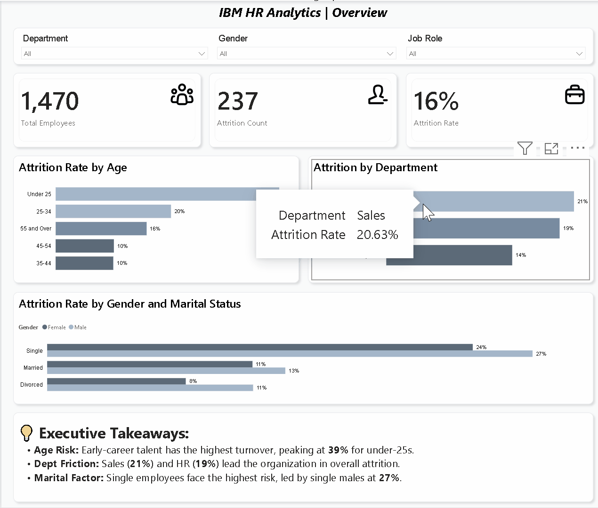

# IBM HR Attrition Analytics

An end-to-end HR analytics project identifying key drivers of employee attrition using IBM's HR dataset. Built with MySQL for data analysis and Power BI for interactive dashboards.

---

## Tools
- MySQL — data extraction and analysis
- Power BI Desktop — dashboard and visualization

---

## Dataset
IBM HR Analytics Employee Attrition & Performance — [Kaggle](https://www.kaggle.com/datasets/pavansubhasht/ibm-hr-analytics-attrition-dataset)

---

## Business Questions
1. What is the age distribution of employees who leave, and which age group has the highest attrition rate?
2. How does attrition rate differ by gender and marital status?
3. Does overtime correlate with higher attrition rates?
4. What is the average work-life balance rating of employees who quit versus those who stay?
5. Do employees who haven't been promoted in over 2 years have higher attrition rates?
6. Which departments have the highest to lowest attrition rates?
7. Does business travel frequency correlate with higher attrition?
8. Is monthly income significantly lower for employees who leave compared to those who stay?

---

## Key Findings
- Employees under 25 have a 39% attrition rate, nearly double the next highest age group
- Single employees are the highest flight risk, with single males at 27% and single females at 24%
- Overtime workers leave at 31%, three times the rate of non-overtime employees (10%)
- Sales (21%) and HR (19%) lead the company in attrition, ahead of R&D (14%)
- Frequent business travelers leave at 25%, compared to just 8% for non-travelers
- Employees who leave earn $4,787/month on average, compared to $6,833 for those who stay
- Recent promotion does not reduce attrition — employees promoted within 2 years actually leave at a slightly higher rate (17%) than those not promoted in over 2 years (14%)

---

## Files
| File | Description |
|------|-------------|
| `IBM_HR_Analysis.sql` | All 8 SQL queries used for analysis |
| `IBM_HR dashboard.pdf` | Power BI dashboard export |
| `IBM_HR.gif` | Interactive dashboard demo |
